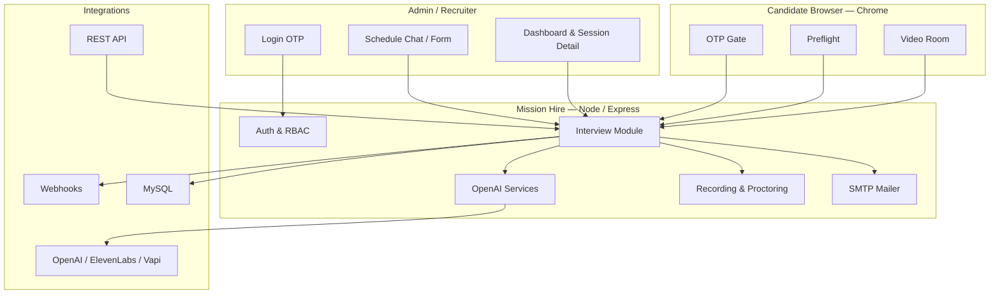

# Mission Hire

**Mission Hire** is an AI-powered recruitment platform for scheduling, conducting, and reviewing **browser-based video interviews**. Recruiters use an admin dashboard to invite candidates, configure questions, and review recordings, proctoring flags, and AI-generated feedback. Candidates complete interviews in Chrome via a secure link—no app install required.

---

## What it does

| Audience | Experience |
|----------|------------|
| **Recruiters / admins** | Log in with OTP, schedule interviews (form or AI chat), monitor active sessions, and review session detail (recording, transcript, Mission verdict, proctoring flags). |
| **Candidates** | Receive an email invite → verify OTP → device preflight (camera/mic) → live video interview with AI voice prompts and auto-submitted answers. |
| **External systems** | REST API to schedule interviews and receive completion / lifecycle webhooks. |

The platform focuses on **browser video interviews**

---

## Tech stack

| Layer | Technology |
|-------|------------|
| **Runtime** | Node.js 20+ (ES modules) |
| **Web framework** | Express 5 |
| **Views** | EJS templates + static assets |
| **Database** | MySQL / MariaDB (`mysql2`) |
| **Auth** | Session-based admin login (email OTP) + tokenized candidate interview links |
| **Authorization** | `accesscontrol` (roles & permissions from DB) |
| **AI** | OpenAI (verdicts, transcription, question generation, schedule chat) |
| **Optional AI** | Anthropic (intent classification during interviews) |
| **Voice (TTS)** | Vapi assistant config + ElevenLabs / Azure / OpenAI TTS fallback |
| **Email** | Nodemailer (Gmail SMTP) |
| **Media** | Browser WebRTC, chunked recording upload, FFmpeg merge (`ffmpeg-static`) |
| **Proctoring** | Client-side gaze/face telemetry + server-side integrity scoring |

---

## Architecture



### Request flow (candidate interview)

1. Admin creates a session → invite email with signed token URL.
2. Candidate verifies OTP → completes device checks.
3. Browser streams webcam/mic; questions play via TTS; answers are recorded and transcribed (Whisper).
4. Proctoring telemetry and snapshots are stored; session ends normally or on integrity violation.
5. AI generates a **Mission verdict** + recommendations; feedback email goes to the recruiter.
6. Optional webhook POSTs summary, flags, recording URL to your portal.

---

## Key features

### Recruiter admin

- **Mission Hire themed UI** — dark slate + gold admin theme
- **Schedule via AI chat** — conversational flow to pick candidate, time, and questions
- **Session management** — scheduled, active, completed, recordings, verification logs
- **Session detail** — recording playback, Q&A transcript, Mission Hire AI verdict, proctoring flags & snapshots
- **Role-based access** — super admin, company admin, granular permissions
- **Company & user management** — multi-tenant company records (super admin)

### Candidate experience

- Email OTP gate on secure token links
- Chrome-only browser video room (mobile blocked)
- Device preflight (camera, microphone, connectivity)
- AI voice for questions (Vapi/ElevenLabs when configured; browser speech fallback)
- Auto-submit answers with live STT + server-side Whisper transcription
- Proctoring: gaze, face absence, tab blur, headphones, integrity scoring

### API & integrations

- `POST /api/v1/schedule/video-interview` — Bearer-authenticated scheduling
- Completion webhooks with flags, snapshots, signed recording URLs
- Optional lifecycle events (`invite_sent`, `otp_verified`, `call_started`, `call_ended`)

See [`modules/candidate-interview/API.md`](modules/candidate-interview/API.md) for full API documentation.

---

## Prerequisites

- **Node.js** 20 or later
- **MySQL / MariaDB** (e.g. XAMPP, local install, or cloud instance)
- **FFmpeg** — bundled via `ffmpeg-static` for recording merge; no separate install usually needed
- **SMTP account** — Gmail app password or other SMTP provider for invites & OTP
- **OpenAI API key** — required for verdicts, transcription, and schedule chat
- **Public URL** — ngrok or deployed domain for `HOST_URL` (candidate links & webhooks)

---

## Installation

### 1. Clone and install dependencies

```bash
git clone <repository-url>
cd mission-hire
npm install
```

### 2. Configure environment

Create a `.env` file in the project root (never commit this file):

```env
# Database
DB_HOST=127.0.0.1
DB_PORT=3306
DB_USER=root
DB_PASS=
DB_NAME=mission-ai

# App URLs & secrets
HOST_URL=http://localhost:3002
SESSION_SECRET=change-me-long-random-string
INTERVIEW_TOKEN_SECRET=change-me-long-random-string

# OpenAI (required)
OPENAI_API_KEY=sk-...

# SMTP (required for email)
MAIL_HOST=smtp.gmail.com
MAIL_PORT=587
MAIL_USERNAME=your@gmail.com
MAIL_PASSWORD=your-app-password
MAIL_FROM_ADDRESS=your@gmail.com
MAIL_FROM_NAME=Mission Hire
MAIL_ENCRYPTION=tls
REPLY_TO_EMAIL=your@gmail.com

# Email routing
TO_EMAIL=recruiter@company.com

# Interview TTS (recommended)
VAPI_PRIVATE_KEY=
VAPI_ASSISTANT_ID=
ELEVENLABS_API_KEY=
ELEVENLABS_VOICE_ID=

# External API auth (optional)
MOCK_INTERVIEW_API_KEY=

# Timezone
DEFAULT_TZ=Asia/Kolkata
```

> **Tip:** On Windows, prefer `DB_HOST=127.0.0.1` over `localhost` to avoid MySQL connection timeouts with `mysql2`.

### 3. Create the database

```sql
CREATE DATABASE IF NOT EXISTS `mission-ai`;
```

Import any base admin/RBAC schema your deployment uses, then start the app—the **Candidate Interview** module runs migrations automatically on boot (`modules/candidate-interview/bootstrap.js`).

### 4. Run the app

```bash
# Development (auto-reload)
npm run dev

# Production
npm start
```

The server listens on **port 3002** by default.

Open:

| URL | Purpose |
|-----|---------|
| `http://localhost:3002/` | Marketing / landing page |
| `http://localhost:3002/login` | Admin login (OTP) |
| `http://localhost:3002/admin/interviews/dashboard` | Interview dashboard (after login) |

### 5. Verify email (optional)

```bash
node scripts/verify-smtp-mail.js you@example.com
```

---

## Project structure

```
MissionAI/
├── index.js                 # Entry: loads .env, OpenAI bootstrap, starts server
├── server.js                # Express app, routes, static files
├── config/
│   ├── db.js                # MySQL connection pool
│   ├── env.js               # Central secret / API key helpers
│   └── openaiClient.js
├── routes/
│   ├── auth.js              # Login, OTP, logout
│   ├── admin.js             # Users, roles, companies, admin pages
│   └── api.js               # REST API
├── modules/candidate-interview/
│   ├── routes.js            # Admin + candidate interview routes
│   ├── controllers/         # Admin, candidate, chat controllers
│   ├── services/            # Orchestrator, verdict, recording, email, …
│   ├── repositories/        # DB access layer
│   └── schema.sql           # Reference schema
├── views/                   # EJS templates
├── public/                  # CSS, JS, assets
└── uploads/                 # Interview snapshots & recordings (gitignored)
```

---

## Environment variables (reference)

| Variable | Required | Purpose |
|----------|----------|---------|
| `DB_*` | Yes | MySQL connection |
| `OPENAI_API_KEY` | Yes | AI verdicts, Whisper, schedule chat |
| `SESSION_SECRET` / `INTERVIEW_TOKEN_SECRET` | Yes (prod) | Session & interview token signing |
| `HOST_URL` | Yes | Public base URL for invites & webhooks |
| `MAIL_*` | Yes | SMTP for OTP & invites |
| `TO_EMAIL` | Recommended | Default feedback recipient |
| `VAPI_*` + `ELEVENLABS_*` | Recommended | Server-side interview TTS voice |
| `MOCK_INTERVIEW_API_KEY` | Optional | Bearer auth for scheduling API |
| `ANTHROPIC_API_KEY` | Optional | Richer intent classification |
| `DEFAULT_TZ` | Optional | Schedule timezone (default `Asia/Kolkata`) |

Legacy telephony variables (`TWILIO_*`, `DEEPGRAM_*`, `BREVO_*`) are **not used** by the current codebase.

---

## Scripts

| Command | Description |
|---------|-------------|
| `npm run dev` | Start with nodemon (watches `server.js`, `modules/`, `routes/`, etc.) |
| `npm start` | Production start via `index.js` |
| `npm test` | Run preflight media check tests |
| `node scripts/verify-smtp-mail.js [email]` | Test SMTP configuration |

---

## Troubleshooting

| Issue | What to check |
|-------|----------------|
| `connect ETIMEDOUT` on startup | MySQL not running; use `127.0.0.1`; read XAMPP `mysql_error.log` |
| Emails not sending | `MAIL_USERNAME` / `MAIL_PASSWORD`; run `verify-smtp-mail.js` |
| No AI voice in interview | Set `VAPI_PRIVATE_KEY`, `VAPI_ASSISTANT_ID`, and `ELEVENLABS_API_KEY`

---
